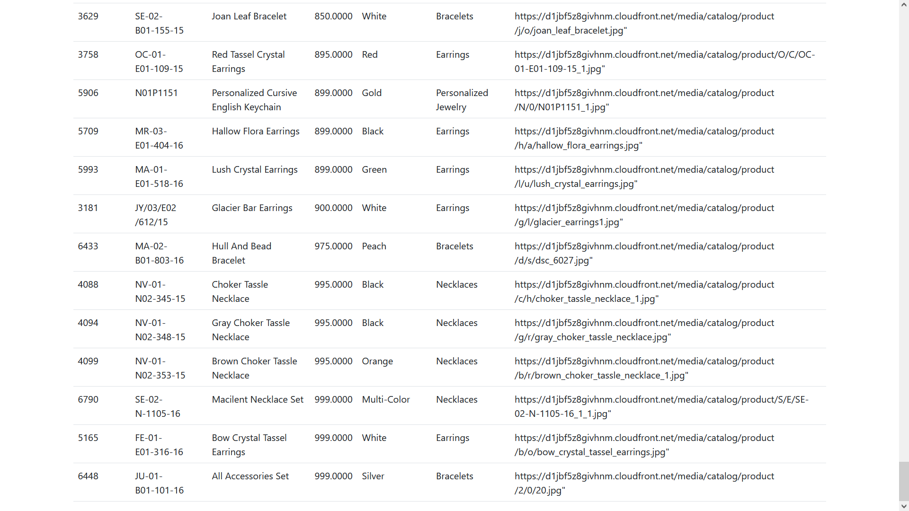

# Task

A Rest API in PHP for product Listing Page


## Features

- Product Listing
- Filters by Price Range, Color and Category.
- Sort by price in Ascending And Descending Order.
## Screenshot

- Home Page

- To load All product Details click on get all product and the data appears

- To Apply Filters on Price Click On Price To Sort it Either in ascending or descending order.


Applying Descending Order Filter

- Filter Data In Range

<1000


1000-2000

 \>2000

- Filter Based On Color

if gold is used as filter

> Note that based on other colors we can filter the data
- Filter Based on Category

if Necklace is used as Filter

> Note that based on other category we can filter the data

## Technology used

- PHP,HTML,BOOTSTRAP,AJAX And JAVAScript
- MySQL Database

## Run Locally

Clone the project

```bash
  git clone https://github.com/rougesocket/RestAPI-Task.git
```

Go to the project directory

```bash
  cd RestAPI-Task
```

## Setup On Local Machine
1. Download the product_list.csv from the repo
2. Install XAMPP
3. Go to PHP MyAdmin And Create a New Database with name "product"
4. Go to import and import the csv file into your database.
5. Optional : Make Necessary Changes accordingly in API/utility/connection.php if name of database or table or port is different.

